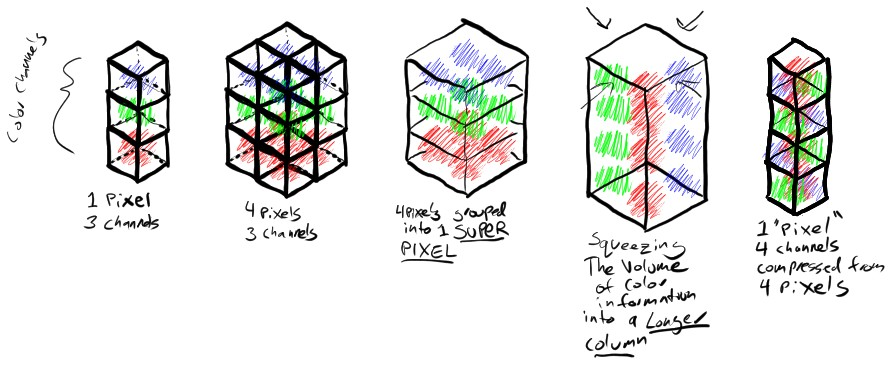
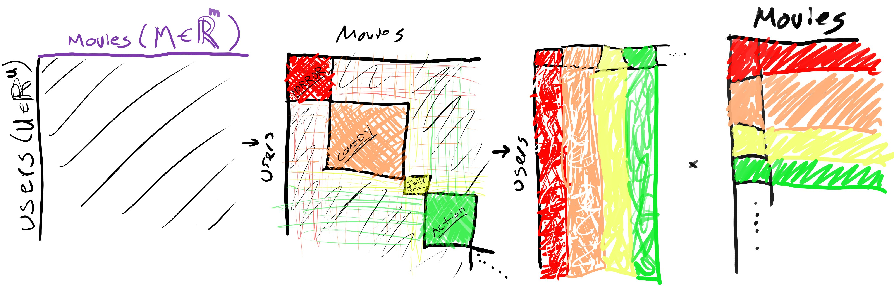

# Course teaches ~~intermediate python~~ generative art topics by building a simple ai art library

labels: from_issue, curriculum, education, publication, public_good, wip

[Link to original issue](https://github.com/dmarx/bench-warmers/issues/34)

# Target audience

- already comfortable with python
- has conversational understanding of deep learning fundamentals, probably hasn't actually taken an ML class
- has experimented minimally with generative AI tools, understands some nuances of prompting.

---

# Assignments/curriculum

* Tools of the trade
  * git
    * git clone
    * git branch
    * git commit
    * git pull
    * git push 
  * venv 
  * image utilities 
    * PILlow
    * ffmpeg
    * cv2
  * DL utilities
    * pytorch
      * tensors
      * state-dicts
    * einops
    * transformers/diffusers/hub
  * prototyping utilities
    * colab
    * gradio
    * panel/voila
    * fastapi
    * a1111
  * vector db
    * DIY w numpy, FAISS, ...?
    * https://github.com/erikbern/ann-benchmarks/
* SGD for hackers
  * incremental updates
  * gradient flow (backprop)
  * gradient accumulation
  * gradient checkpointing
  * Adam, momentum
* intro to latents
  * case study:
    * want to seat people at a wedding based on similar movie interests.
    * each completes a card indicating count of movies by genre they've seen in past year
    * use this to motivate cosine similarity, vector components/basis, vector addition, vectors as directions
  * pretty much only linear algebra we need: `<m x n> * <n x k> = <m x k>`
  * vectors are directions, not coordinates
  * simple small vocab basis with bag of words
  * cosine similarity
    * https://www.reddit.com/r/MLQuestions/comments/15vps3r/linking_documents_together/jxdpyxn/?context=3
    * the idea here is basically a notational convenience that comes from linear algebra. i'm planning to record a lesson on this topic soon, i'll try to remember to share it with you. the gist of it goes something like this:

      picture an X/Y axis and drop a point anywhere you feel like. if we draw a line from the origin (0,0) to that point (x,y), we get a line with a direction and a magnitude.

      let's pretend we were actually looking at a clock face this whole time, and the direction our vector is pointing is what time it is. now let's say we want to compare two clocks to see if they're telling the same time: it doesn't matter how big the clock is, only what direction the hands are facing. this is how we'll define "similarity" with our vectors too, and the "dot product" is an operation for calculating the angle between them. if the two clocks are telling the same time, the cosine of this angle will be 1. if they're off by 6 hours (pointing in opposite directions), the cosine will be -1. if they're at right angles to each other (off by 3 hours) the cosine will be 0. if we consider "parallel" to be as good as "pointing in the same direction, but negative magnitude", then the most "different" two clocks can be is if they're faces are at right angles to each other.

      in this example, our vectors were 2D (x,y), but we can do this with arbitrarily many dimensions and use this geometric interpretation of vectors as directions to compute similarities between vectors of arbitrarily many dimensions by calculating the cosine between them. It just so happens this operation can be interpreted as a kind of multi-dimensional multiplication, but don't worry about that. 
  * matrix factorization -> topic modeling
 

* autoencoders, shared latents
  * simple image compression
  * old school deepfake
  * intro to CLIP space
    * shared multimodal latent manifold, distinct text vs. image regions (revisit this with CLIP-DIP, unCLIP-DIP)
    * semantic search (image retrieval) with CLIP
    * Differences in outputs:
      * final hidden state (conventional)
      * all hidden states (minimaxir)
      * early exit aka "skip states"
* SGD - deepdream, PEZ, clip interrogator
* classifier-guided t2i - CLIP-RGB
* differentiable image parameterization - CLIP-DIP
* two-phase modeling with autoencoders - CLIP-VQGAN
* denoising autoencoders, diffusion schedules, CFG - SD t2i, cold diffusion (blurring diffusion, heat dissipation... something non-gaussian)
  * classifier free guidance, null token as prior - CFG, NTI
  * reversing corruption processes - cold diffusion, etc.
  * denoising image vs denoising latent
  * auto-regressive conditioning
    * in-painting - RePaint
    * prompt-to-prompt
    * img2img
  * cross attention guidance
    * token weighting
    * prompt-to-prompt
    * compositional / regional prompting
* animation
  * composition from motion - VQGAN i2i, 2D transforms
  * color correction, new vae - SD i2i 2D
  * depth estimation, optical flow, 3d transforms - SD i2i 3D
  * basic ffmpeg
* finetuning - dreambooth, TI
* advanced topics
  * multi-prompting
  * controlnet
  * lora
  * region prompting
  * KLMC2
  * AnimateDiff
* bonus topics
  * stylegan
  * style transfer
  * token merging
  * NeRF
  * text-to-3d
  * audio-reactivity
    * this could basically be a whole separate course/book

Discuss the history as we go
 
# Title ideas

* AI Internals - actually, maybe make this a youtube channel +socials/discord
* AI Art Technical Masterclass: Under-the-hood of Generative AI Tools
* AI Mastercraft
* Intro to Latents

# Misc

> Each pixel in the stable diffusion VAE latent corresponds to a region of 8x8 pixels in RGB space. Here's a rough illustration of how information from a neighborhood of RGB pixels (here 2x2 instead of 8x8) gets compressed into a single pixel of the VAE latent

https://twitter.com/DigThatData/status/1737945262201668050

---

> Wondering what "low rank" means when you hear about stuff like LoRA? In this diagram, the "rank" is the number of genres you're using to describe the users/movies matrix. This is also why rank-reduced representations can often be interpreted as a kind of semantic compression.

https://twitter.com/DigThatData/status/1679724092826734593
